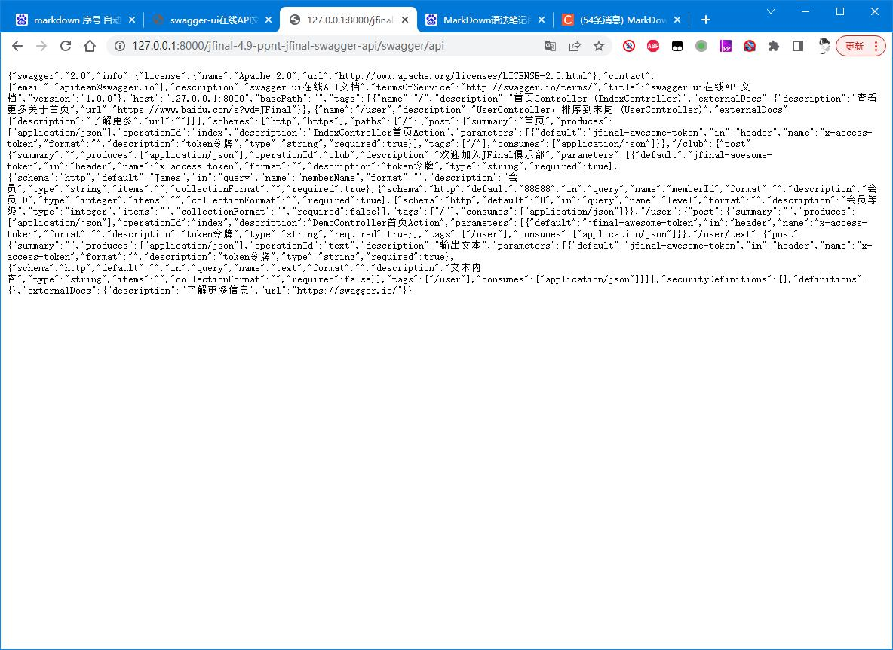
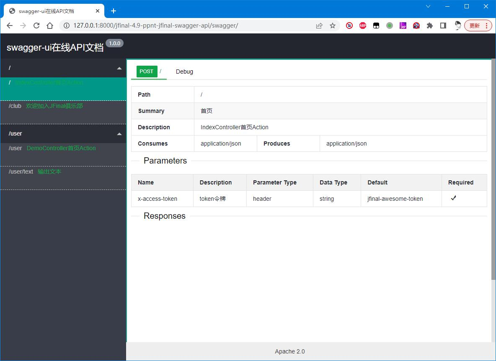
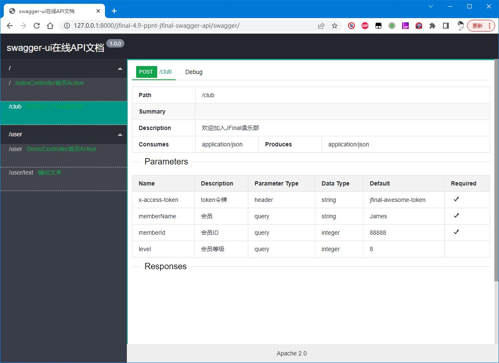
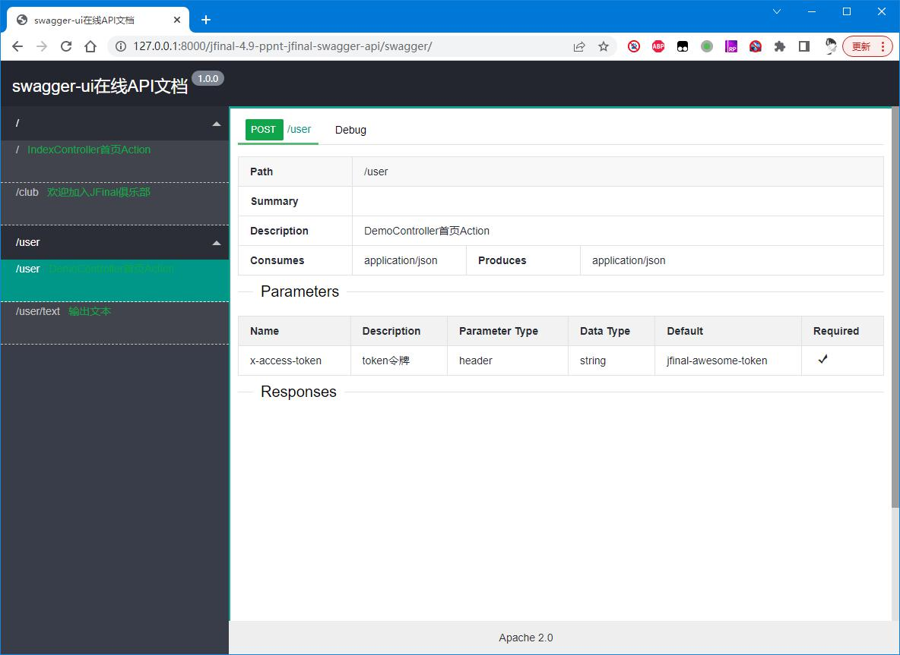
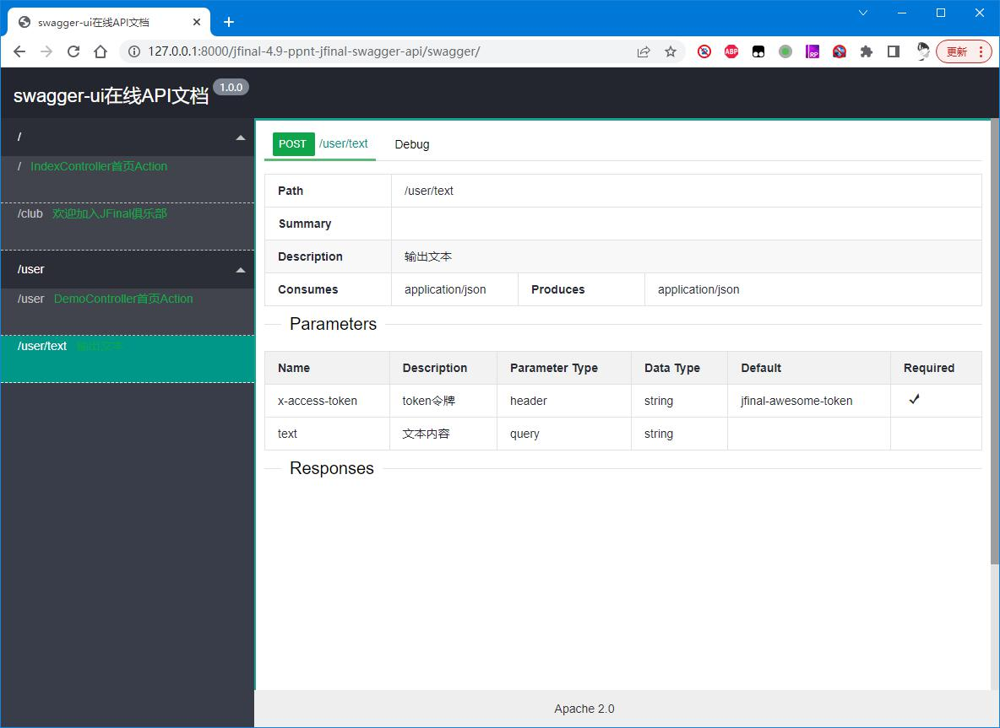
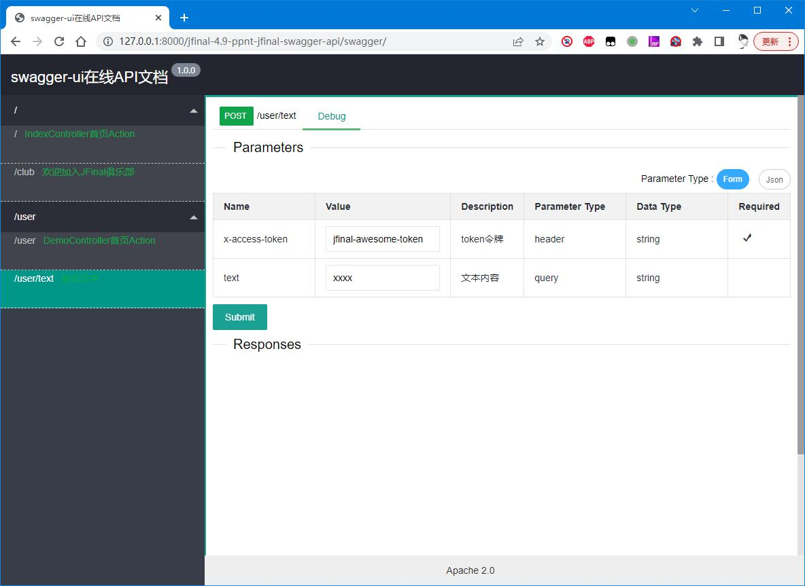
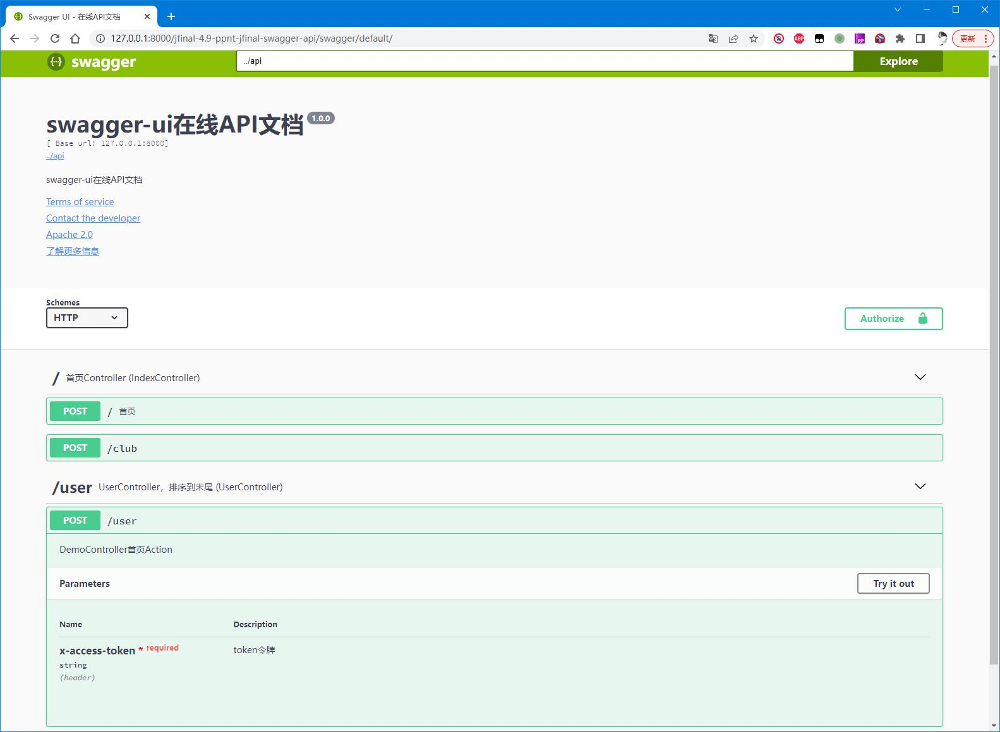

# ppnt-jfinal-swagger-api
提供jfinal整合swaager的支持

# 快速接入
1.添加依赖已经上传到maven仓库
```
    <dependency>
      <groupId>top.ppnt</groupId>
      <artifactId>ppnt-jfinal-swagger-api</artifactId>
      <version>1.0.0</version>
    </dependency>
```

2.修启动类,添加undertowServer.addHotSwapClassPrefix(PpntSwaggerConstants.packageName);
```
package top.ppnt.jfinal.swagger;

import com.jfinal.server.undertow.UndertowServer;

import top.ppnt.jfinal.swaager.api.constants.PpntSwaggerConstants;
import top.ppnt.jfinal.swagger.config.AppConfig;

public class PpntSwaggerApp {
  public static void main(String[] args) {
    UndertowServer undertowServer = UndertowServer.create(AppConfig.class);
    undertowServer.addHotSwapClassPrefix(PpntSwaggerConstants.packageName);
    undertowServer.start();
  }
}
```

3.添加路由 me.add(new SwaggerRoutes());
```
package top.ppnt.jfinal.swagger.config;

import com.jfinal.config.Constants;
import com.jfinal.config.Handlers;
import com.jfinal.config.Interceptors;
import com.jfinal.config.JFinalConfig;
import com.jfinal.config.Plugins;
import com.jfinal.config.Routes;
import com.jfinal.template.Engine;

import top.ppnt.jfinal.swaager.api.config.SwaggerConfig;
import top.ppnt.jfinal.swaager.api.config.SwaggerRoutes;
import top.ppnt.jfinal.swaager.api.enums.InType;

public class AppConfig extends JFinalConfig {
  /**
   * 配置访问路由
   * 
   * @param me
   */
  @Override
  public void configRoute(Routes me) {
    // 配置Swagger UI访问路由
    me.add(new SwaggerRoutes());
    String basePackage = "top.ppnt.jfinal.swagger";
    me.scan(basePackage + ".controller.");
  }

  /**
   * JFinal启动完成后的操作
   */
  @Override
  public void onStart() {
    // 添加全局参数(如token,非必需)
    SwaggerConfig.addGlobalParam("x-access-token", "token令牌", "string", "jfinal-awesome-token", true, "", InType.HEADER);
  }

  public void configConstant(Constants me) {
    // me.setDevMode(true);
    // 开启对 jfinal web 项目组件 Controller、Interceptor、Validator 的注入
    me.setInjectDependency(true);

    // 开启对超类的注入。不开启时可以在超类中通过 Aop.get(...) 进行注入
    me.setInjectSuperClass(true);
  }

  @Override
  public void configEngine(Engine me) {

  }

  @Override
  public void configPlugin(Plugins me) {

  }

  @Override
  public void configInterceptor(Interceptors me) {

  }

  @Override
  public void configHandler(Handlers me) {

  }
}
```
4.修改undertow.txt添加undertow.resourcePath
```
undertow.devMode=true
undertow.host=127.0.0.1
undertow.port=8000
undertow.contextPath=/jfinal-4.9-ppnt-jfinal-swagger-api

undertow.resourcePath = classpath:META-INF/resources
```
5.添加Controller类
IndexController 添加文档
```
package top.ppnt.jfinal.swagger.controller;

import java.util.Arrays;

import com.jfinal.core.Controller;
import com.jfinal.core.Path;
import com.jfinal.kit.Kv;

import top.ppnt.jfinal.swaager.api.annotation.ActionApi;
import top.ppnt.jfinal.swaager.api.annotation.Api;
import top.ppnt.jfinal.swaager.api.annotation.Param;
import top.ppnt.jfinal.swaager.api.annotation.Params;
import top.ppnt.jfinal.swaager.api.enums.InType;

@Api(tag = "/", remark = "首页Controller", sort = 1, outerRemark = "查看更多关于首页", outerUrl = "https://www.baidu.com/s?wd=JFinal")
@Path("/")
public class IndexController extends Controller {

  @ActionApi(tag = "/", remark = "IndexController首页Action", summary = "首页", sort = 1)
  public void index() {
    renderJson(Kv.by("index", "Hello JFinal!"));
  }

  @ActionApi(tag = "/", remark = "欢迎加入JFinal俱乐部", httpMethod = "post", sort = 2, consumes = "application/json", url = "/club")
  @Params({
      @Param(name = "memberName", remark = "会员", dataType = "string", defaultValue = "James", required = true, in = InType.QUERY, format = "", schema = "http"),
      @Param(name = "memberId", remark = "会员ID", dataType = "integer", defaultValue = "88888", required = true, minimum = "1", maximum = "999999"),
      @Param(name = "level", remark = "会员等级", dataType = "integer", defaultValue = "8") })
  public void club() {
    String memberName = get("memberName");
    int memberId = getInt("memberId");
    int level = getInt("level");
    Kv cnKv = Kv.by("welcome", memberName + ":欢迎加入JFinal俱乐部!").set("memberId", memberId).set("level", level);
    Kv enKv = Kv.by("welcome", memberName + ":Welcome to JFinal club!").set("memberId", memberId).set("level", level);
    renderJson(Arrays.asList(cnKv, enKv));
  }
}
```
UserController
```
package top.ppnt.jfinal.swagger.controller;

import com.jfinal.core.Controller;
import com.jfinal.core.Path;
import com.jfinal.kit.Kv;

import top.ppnt.jfinal.swaager.api.annotation.ActionApi;
import top.ppnt.jfinal.swaager.api.annotation.Api;
import top.ppnt.jfinal.swaager.api.annotation.Param;

@Api(remark = "UserController，排序到末尾", sort = 2)
@Path("user")
public class UserController extends Controller {

  @ActionApi(remark = "DemoController首页Action")
  public void index() {
    renderJson(Kv.by("user", "Hello JFinal!"));
  }

  @ActionApi(remark = "输出文本")
  @Param(name = "text", remark = "文本内容")
  public void text() {
    renderText("输出接收文本：<br>" + get("text"));
  }
}
```
6.启动访问测试  
http://127.0.0.1:8000/工程名/swagger/  

7.获取文档描述信息  
http://127.0.0.1:8000/工程名/swagger/api
响应如下  
可以将文档描述信息导入到postman,apifox,apipost中

## 显示效果
### layui 显示效果
http://127.0.0.1:8000/工程名/swagger/  





### 默认显示效果
请求地址  
http://127.0.0.1:8000/工程名/swagger/default/

